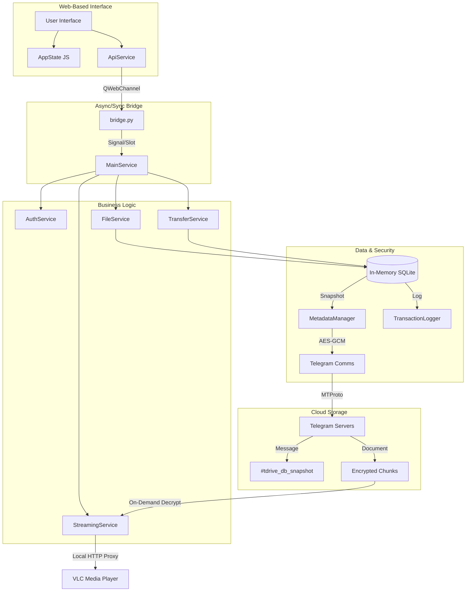

# 🚀 TDrive: Telegram-Powered Unlimited Cloud Storage

[**繁體中文 (Traditional Chinese)**](./docs/README_zh.md) | [**Developer Documentation**](./docs/DEVELOPER.md)

**TDrive** is an innovative desktop cloud drive client that leverages Telegram's unlimited message storage. It provides a **theoretically infinite, fully encrypted, and permanently free** private cloud space.

---

## ✨ Key Features

### 📂 Unlimited Storage & Smart Sync
*   **Infinite Capacity**: Powered by the Telegram MTProto protocol, utilizing Telegram message channels for file storage without capacity limits.
*   **Intelligent Chunking**: Automatically splits large files into encrypted chunks, effortlessly bypassing Telegram's single-file size restrictions.
*   **Instant Upload (Deduplication)**: Identifies files via cryptographic hashes; identical files already in the cloud are linked instantly without re-uploading.

### 🔐 Bank-Grade Security
*   **End-to-End Encryption (E2EE)**: All files are AES-256 encrypted locally before leaving your device. Keys remain exclusively on your machine; even Telegram cannot read your data.
*   **Hardware-Bound Keys**: Session data and sensitive credentials are locked using your unique hardware ID to prevent unauthorized access from other devices.

### 📺 Premium Multimedia Experience
*   **Instant Streaming**: Built-in local streaming proxy allows you to play cloud videos instantly using players like VLC without waiting for a full download.
*   **Memory-Optimized Gallery**: Generates and syncs thumbnails to the cloud for a fast, seamless gallery browsing experience.

---

## 🚀 Quick Start

TDrive is distributed as a standalone executable. No Python environment setup is required.

### 1. Download
Download the latest version of `TDrive.exe` from the [Releases](https://github.com/yourusername/TDrive/releases) page.

### 2. Obtain Telegram API Keys (Required)
To use TDrive, you must obtain your own API credentials from Telegram:
1.  Log in to your Telegram account at [**my.telegram.org**](https://my.telegram.org).
2.  Click on **"API development tools"**.
3.  Fill out the form to create a new application (the title and short name can be anything, e.g., "MyTDrive").
4.  You will receive an **`App api_id`** and **`App api_hash`**.
5.  Launch `TDrive.exe` and enter these credentials when prompted.

---

## 🏗️ Technical Architecture

TDrive uses a sophisticated "Stateless-to-Stateful" architecture to turn a messaging platform into a robust file system.

### The "Cloud-as-Database" Model
1.  **In-Memory DB**: All folder structures and file metadata are managed in a high-speed, in-memory SQLite database.
2.  **Cloud Snapshots**: Periodically, the database state is dumped, compressed, encrypted, and "snapshotted" to a private Telegram group.
3.  **Instant Recovery**: When logging in from any device, TDrive fetches the latest snapshot to instantly restore your entire drive directory.

### System Flow

---

## 🛡️ Privacy Statement

Your data privacy is our absolute priority:
*   TDrive **does not** collect or store any user data on its own servers.
*   All data transfers happen directly between your device and official Telegram servers.
*   Encryption keys are generated locally and are never shared with third parties.

---

## 📄 License

This project is licensed under the MIT License. See the [LICENSE](LICENSE) file for details.

---
*For internal implementation details, please refer to [DEVELOPER.md](./DEVELOPER.md)*
