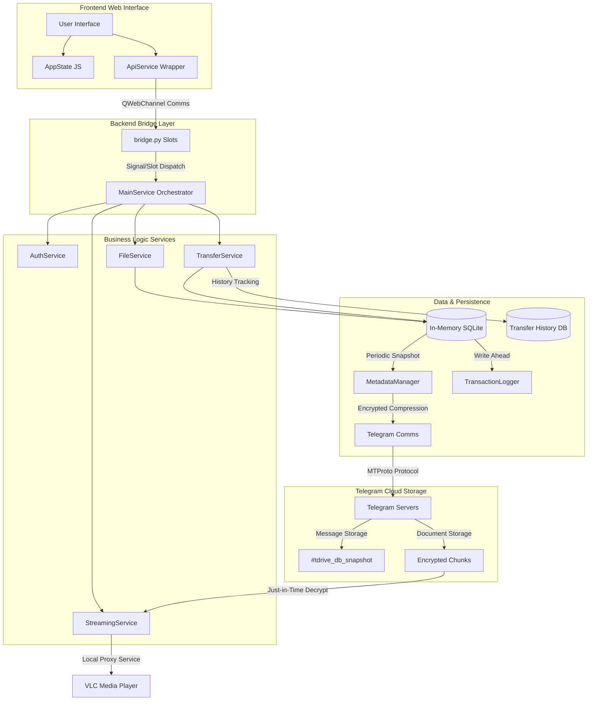

# TDrive Project Technical Documentation

[**繁體中文 (Traditional Chinese)**](./DEVELOPER_zh.md) | [**Back to README**](../README.md)

TDrive is a desktop cloud storage client that utilizes Telegram as its backend storage engine. Built with a PySide6 WebEngine hybrid architecture, it combines Python's powerful asynchronous processing with a modern web-based UI for a seamless user experience.

---

## 1. Project Directory Structure Overview

The project structure is highly decoupled, separating the interface, business logic, and low-level communication:

*   **`core_app/`**: Backend core directory, containing API communication, data management, business services, and UI window definitions.
*   **`web/`**: Frontend resource directory, containing HTML pages, CSS stylesheets, and JavaScript modules for interaction logic.
*   **`file/`**: Local data directory for encrypted sessions, transaction logs, and the transfer history database.
*   **`main.py`**: The application entry point.

---

## 2. Functional Modules & Detailed File Analysis

### A. Core & Infrastructure

Responsible for application lifecycle management, frontend-backend bridging, and global error handling.

*   **main.py**
    - **Path**: `main.py`
    - **Language**: Python
    - **Function**: Application entry point. Initializes the PySide6 app, SplashScreen, and AppController.
    - **Dependencies**: PySide6, qasync, core_app (main_service, ui.windows).
    - **Classes/Functions**: `AppController` (Main controller), `main()` (Bootstrap function).

*   **core_app/main_service.py**
    - **Path**: `core_app/main_service.py`
    - **Language**: Python
    - **Function**: Core service orchestrator. Initializes the data layer (DB, Metadata) and all sub-services (Auth, File, Transfer, Streaming).
    - **Dependencies**: asyncio, .data, .services.
    - **Classes/Functions**: `TDriveService` (Primary service class).

*   **core_app/bridge.py**
    - **Path**: `core_app/bridge.py`
    - **Language**: Python
    - **Function**: Frontend-backend bridge. Exposes Python async functions to JS via PySide6 Slots and manages async/sync thread bridging.
    - **Dependencies**: PySide6.QtCore, asyncio, .main_service.
    - **Classes/Functions**: `Bridge` (Communication class).

*   **core_app/data/shared_state.py**
    - **Path**: `core_app/data/shared_state.py`
    - **Language**: Python
    - **Function**: Global shared state. Stores the Telegram Client instance, API credentials, event loop, and active task lists shared across sub-services.
    - **Dependencies**: telethon, asyncio.
    - **Classes/Functions**: `SharedState`.

*   **core_app/common/errors.py**
    - **Path**: `core_app/common/errors.py`
    - **Language**: Python
    - **Function**: Defines custom exception classes and unified error codes to ensure consistent error handling between frontend and backend.
    - **Classes/Functions**: `PathNotFoundError`, `ItemAlreadyExistsError`, `ErrorCode`.

*   **core_app/common/logger_config.py**
    - **Path**: `core_app/common/logger_config.py`
    - **Language**: Python
    - **Function**: Logging configuration. Supports JSON log output, log rotation, and console formatting.
    - **Dependencies**: logging, json, datetime.
    - **Classes/Functions**: `JSONFormatter`, `setup_logging`.

*   **core_app/ui/windows/splash_screen.py**
    - **Path**: `core_app/ui/windows/splash_screen.py`
    - **Language**: Python
    - **Function**: Animated splash screen. Uses QPainter to render high-quality gradient backgrounds, glowing logos, and a comet progress bar for visual feedback during initialization.
    - **Dependencies**: PySide6.QtGui, PySide6.QtCore.
    - **Classes/Functions**: `SplashScreen`, `paintEvent`.

---

### B. Comms, Security & Auth

Ensures encrypted communication with Telegram servers and manages user account security.

*   **core_app/api/telegram_comms.py**
    - **Path**: `core_app/api/telegram_comms.py`
    - **Language**: Python
    - **Function**: Low-level Telegram communication. Wraps Telethon API to handle group creation, chunked upload/download, and automatic retry mechanisms (backoff) with FloodWait handling.
    - **Dependencies**: telethon, asyncio, .crypto_handler, .file_processor.
    - **Classes/Functions**: `upload_file_to_cloud`, `download_file`, `get_group_id`, `_retry_with_backoff`.

*   **core_app/api/crypto_handler.py**
    - **Path**: `core_app/api/crypto_handler.py`
    - **Language**: Python
    - **Function**: Security encryption layer. Implements AES-GCM encryption/decryption and PBKDF2 key derivation with hardware-bound keys.
    - **Dependencies**: cryptography, hashlib, machineid.
    - **Classes/Functions**: `encrypt_secure_data`, `decrypt_secure_data`, `hash_data`, `generate_key`.

*   **core_app/services/common/auth_service.py**
    - **Path**: `core_app/services/common/auth_service.py`
    - **Language**: Python
    - **Function**: Authentication service. Implements QR login, phone number verification, 2FA flows, encrypted credential storage, and drive initialization (group setup).
    - **Dependencies**: telethon, qrcode, .session_manager, ..api.telegram_comms.
    - **Classes/Functions**: `AuthService`, `start_qr_login`, `check_startup_login`, `initialize_drive`.

*   **core_app/services/common/session_manager.py**
    - **Path**: `core_app/services/common/session_manager.py`
    - **Language**: Python
    - **Function**: Session manager. Securely encrypts and decrypts Telegram Session strings using hardware-bound keys to prevent hijacking.
    - **Dependencies**: telethon.sessions, ..api.crypto_handler.
    - **Classes/Functions**: `SessionManager`.

*   **core_app/services/common/utils.py**
    - **Path**: `core_app/services/common/utils.py`
    - **Language**: Python
    - **Function**: Shared utilities. Includes automatic reconnection logic and UI connection status emitters.
    - **Dependencies**: telethon, asyncio.
    - **Classes/Functions**: `ensure_client_connected`.

---

### C. Data & Persistence

Implements TDrive's unique "Cloud-as-Database" architecture, syncing the in-memory DB with Telegram cloud snapshots.

*   **core_app/data/db_handler.py**
    - **Path**: `core_app/data/db_handler.py`
    - **Language**: Python
    - **Function**: Database handler. Manages the in-memory SQLite database, including table definitions, FTS5 search index, triggers, and CRUD operations.
    - **Dependencies**: sqlite3, threading, .transaction_logger, .sync_manager.
    - **Classes/Functions**: `DatabaseHandler` (Singleton pattern).

*   **core_app/data/metadata_manager.py**
    - **Path**: `core_app/data/metadata_manager.py`
    - **Language**: Python
    - **Function**: Cloud metadata manager. Handles database snapshot uploads/restorations, Map File lifecycle management, and folder thumbnail database synchronization.
    - **Dependencies**: json, gzip, asyncio, .db_handler, ..api.telegram_comms.
    - **Classes/Functions**: `MetadataManager`, `initialize_db`, `sync_db_to_cloud`, `fetch_map_file`.

*   **core_app/data/sync_manager.py**
    - **Path**: `core_app/data/sync_manager.py`
    - **Language**: Python
    - **Function**: Adaptive sync controller. Triggers cloud snapshots based on operation frequency scores, with support for debouncing and busy-state masking.
    - **Dependencies**: threading, asyncio.
    - **Classes/Functions**: `SyncManager`.

*   **core_app/data/transaction_logger.py**
    - **Path**: `core_app/data/transaction_logger.py`
    - **Language**: Python
    - **Function**: Transaction logger. Records SQL commands to a local binary file to prevent data loss via replay after a crash.
    - **Dependencies**: pickle, os, sqlite3.
    - **Classes/Functions**: `TransactionLogger`.

*   **core_app/data/transfer_db_handler.py**
    - **Path**: `core_app/data/transfer_db_handler.py`
    - **Language**: Python
    - **Function**: Transfer history database. Manages `transfer_history.db` on disk, recording task progress, traffic statistics, and created artifacts.
    - **Dependencies**: sqlite3, json, time.
    - **Classes/Functions**: `TransferDBHandler`.

---

### D. File System & Transfer

Manages the directory display logic and complex chunked transfer strategies.

*   **core_app/services/file_system/file_service.py**
    - **Path**: `core_app/services/file_system/file_service.py`
    - **Language**: Python
    - **Function**: File business logic. Implements list retrieval, renaming, deletion, and searching.
    - **Dependencies**: asyncio, ..media.gallery_manager, ..data.db_handler.
    - **Classes/Functions**: `FileService`, `get_folder_contents`, `search_db_items`, `delete_items_permanently`.

*   **core_app/services/file_system/folder_service.py**
    - **Path**: `core_app/services/file_system/folder_service.py`
    - **Language**: Python
    - **Function**: Folder-specific services. Retrieves flat tree data for sidebar navigation.
    - **Dependencies**: ..data.db_handler.
    - **Classes/Functions**: `FolderService`.

*   **core_app/services/file_system/file_status_watcher.py**
    - **Path**: `core_app/services/file_system/file_status_watcher.py`
    - **Language**: Python
    - **Function**: Status monitor. Periodically checks the existence of local and cloud items to update UI status tags in real-time.
    - **Dependencies**: asyncio, os, ..data.db_handler.
    - **Classes/Functions**: `FileStatusWatcher`, `add_watch`, `_check_loop`.

*   **core_app/services/transfer/transfer_service.py**
    - **Path**: `core_app/services/transfer/transfer_service.py`
    - **Language**: Python
    - **Function**: Transfer orchestrator. Schedules strategies, manages concurrency (Semaphore), and handles pause/cancel logic.
    - **Dependencies**: asyncio, .strategies, ..file_system.file_status_watcher.
    - **Classes/Functions**: `TransferService`, `resume_transfer`, `cancel_transfer`.

*   **core_app/services/transfer/transfer_controller.py**
    - **Path**: `core_app/services/transfer/transfer_controller.py`
    - **Language**: Python
    - **Function**: Transfer controller. Manages daily traffic stats and updates task progress in the database.
    - **Dependencies**: asyncio, datetime, ..data.transfer_db_handler.
    - **Classes/Functions**: `TransferController`, `update_transferred_bytes`, `add_upload_task`.

*   **core_app/services/transfer/strategies/upload_strategy.py**
    - **Path**: `core_app/services/transfer/strategies/upload_strategy.py`
    - **Language**: Python
    - **Function**: Upload strategy implementation. Includes deduplication (sec-upload) checks, chunked encryption, thumbnail generation, and batch Map File updates.
    - **Dependencies**: asyncio, sqlite3, ..base_strategy, ...api.telegram_comms, ...media.image_processor.
    - **Classes/Functions**: `UploadStrategy`, `upload_folder_recursive`, `_finalize_thumbnails`.

*   **core_app/services/transfer/strategies/download_strategy.py**
    - **Path**: `core_app/services/transfer/strategies/download_strategy.py`
    - **Language**: Python
    - **Function**: Download strategy implementation. Handles recursive folder downloads and single-file retrieval with integrity verification.
    - **Dependencies**: asyncio, os, ..base_strategy, ...api.telegram_comms.
    - **Classes/Functions**: `DownloadStrategy`, `_download_folder`, `_download_single_item`.

*   **core_app/api/file_processor.py**
    - **Path**: `core_app/api/file_processor.py`
    - **Language**: Python
    - **Function**: Physical file processor. Handles file chunking, encrypted stream reading, and disk space pre-allocation.
    - **Dependencies**: os, .crypto_handler.
    - **Classes/Functions**: `stream_split_and_encrypt`, `prepare_download_file`.

---

### E. Media & Streaming

Provides smooth image previews and near-instant video streaming.

*   **core_app/services/media/gallery_manager.py**
    - **Path**: `core_app/services/media/gallery_manager.py`
    - **Language**: Python
    - **Function**: Resource cache management. Maintains the thumbnail database and an LRU cache for preview images.
    - **Dependencies**: sqlite3, base64, ..data.db_handler.
    - **Classes/Functions**: `GalleryManager`, `LRUCache`, `load_thumbs_db_from_bytes`.

*   **core_app/services/media/image_processor.py**
    - **Path**: `core_app/services/media/image_processor.py`
    - **Language**: Python
    - **Function**: Image processing. Uses PySide6's QImage to generate thumbnails and 1080p previews entirely in memory.
    - **Dependencies**: PySide6.QtGui, PySide6.QtCore.
    - **Classes/Functions**: `ImageProcessor`, `process_image`.

*   **core_app/services/media/streaming_service.py**
    - **Path**: `core_app/services/media/streaming_service.py`
    - **Language**: Python
    - **Function**: Streaming proxy. Hosts a local HTTP server supporting Range requests for random-access video playback.
    - **Dependencies**: aiohttp, secrets, .stream_buffer, ..data.db_handler.
    - **Classes/Functions**: `StreamingService`, `handle_stream`.

*   **core_app/services/media/stream_buffer.py**
    - **Path**: `core_app/services/media/stream_buffer.py`
    - **Language**: Python
    - **Function**: Stream buffer. Downloads and decrypts encrypted chunks on-demand with readahead support.
    - **Dependencies**: asyncio, io, ..api.telegram_comms.
    - **Classes/Functions**: `StreamBuffer`, `read`, `_readahead`.

*   **core_app/services/media/player_service.py**
    - **Path**: `core_app/services/media/player_service.py`
    - **Language**: Python
    - **Function**: Player driver. Integrates and invokes the built-in VLC executable for streaming playback.
    - **Dependencies**: subprocess, os.
    - **Classes/Functions**: `PlayerService`, `play_video`.

---

### F. Frontend Framework & User Interface

Manages UI interaction, state persistence, and API calls within the WebEngine.

*   **web/js/main.js**
    - **Function**: Frontend controller. Initializes all handlers, connects backend signals, and manages global drag-and-drop.

*   **web/js/login.js**
    - **Function**: Login logic. Controls API verification, QR generation, phone code, and 2FA flows.

*   **web/js/core/api_service.js**
    - **Function**: API gateway. Wraps backend bridge calls into Promise objects.

*   **web/js/core/state.js**
    - **Function**: Global state. Manages the current directory, selections, sorting, and view modes.

*   **web/js/core/ui_manager.js**
    - **Function**: Visual utilities. Manages progress bars, icon mapping, byte conversion, and error handling.

*   **web/js/features/action_handler.js**
    - **Function**: Business logic handler. Implements moves (with tree selection), renaming, searching, and logout.

*   **web/js/features/file_list_handler.js**
    - **Function**: List renderer. Manages List/Grid views, sorting, and multi-selection marquee.

*   **web/js/features/file_tree_handler.js**
    - **Function**: Sidebar controller. Implements recursive tree rendering and smart expansion state.

*   **web/js/features/transfer_manager.js**
    - **Function**: Task manager. Manages upload/download queues, responding to real-time progress signals and traffic stats.

*   **web/js/features/gallery_handler.js**
    - **Function**: Gallery viewer. Provides full-screen image browsing with preloading.

*   **web/js/features/trash_handler.js**
    - **Function**: Recycle Bin handler. Loads deleted items, reconstructs original paths, and handles restoration.

*   **web/js/features/settings_handler.js**
    - **Function**: Settings manager. Manages and persists user preferences via `localStorage`.

*   **web/js/utils/ui_modals.js**
    - **Function**: Interaction modals. Provides Promise-based OK/Cancel and Prompt modules.

*   **core_app/ui/windows/main_window.py** & **core_app/ui/windows/login_window.py**
    - **Function**: PySide6 window containers that host frontend HTML and register communication channels.

*   **core_app/ui/gui_utils.py**
    - **Function**: Native dialog utilities for file selection and shell integration.

---

## 3. Overall System Architecture

---
*Last Updated: 2026-02-24*
