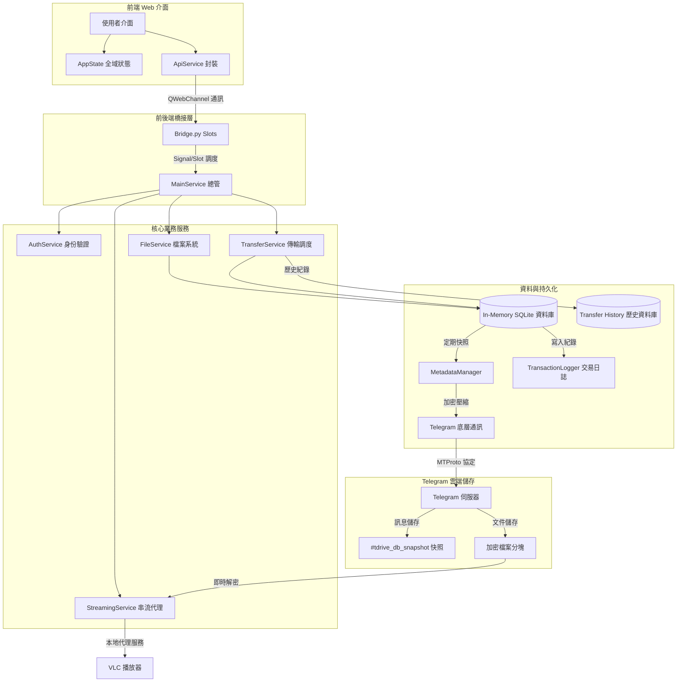

# TDrive 專案技術說明文件

[**English (英文)**](./DEVELOPER.md) | [**返回首頁 (Back to README)**](../README.md)

TDrive 是一個利用 Telegram 作為後端儲存引擎的無限雲端硬碟桌面用戶端。本專案採用 PySide6 WebEngine 混合架構，結合了 Python 強大的非同步處理能力與現代化網頁 UI 的互動體驗。

---

## 1. 專案目錄結構概覽

本專案結構清晰，將介面、業務邏輯與底層通訊完全解耦：

*   **`core_app/`**: 後端核心目錄，包含 API 通訊、資料管理、業務服務與 UI 視窗定義。
*   **`web/`**: 前端資源目錄，包含 HTML 頁面、CSS 樣式表及負責互動邏輯的 JavaScript 模組。
*   **`file/`**: 本地資料夾，用於存放加密的 Session、交易日誌及傳輸歷史資料庫。
*   **`main.py`**: 應用程式啟動進入點。

---

## 2. 功能模組與檔案詳細分析

### A. 系統核心、架構與基礎設施 (Core & Infrastructure)

本模組負責應用程式的生命週期管理、前後端通訊橋接以及全域錯誤處理。

*   **main.py**
    - **路徑**: `main.py`
    - **語言**: Python
    - **功能**: 應用程式進入點。負責初始化 PySide6 應用程式、啟動畫面 (Splash Screen) 與 AppController。
    - **依賴**: PySide6, qasync, core_app (main_service, ui.windows).
    - **類別/函數**: `AppController` (主控類別), `main()` (啟動函數).

*   **core_app/main_service.py**
    - **路徑**: `core_app/main_service.py`
    - **語言**: Python
    - **功能**: 核心服務協調者。初始化資料層 (DB, Metadata) 與子服務 (Auth, File, Transfer, Streaming)。
    - **依賴**: asyncio, .data, .services.
    - **類別/函數**: `TDriveService` (主要服務類別).

*   **core_app/bridge.py**
    - **路徑**: `core_app/bridge.py`
    - **語言**: Python
    - **功能**: 前後端橋樑。利用 PySide6 的 Slots 將 Python 功能暴露給 JS 呼叫，並處理非同步/同步執行緒橋接。
    - **依賴**: PySide6.QtCore, asyncio, .main_service.
    - **類別/函數**: `Bridge` (通訊類別).

*   **core_app/data/shared_state.py**
    - **路徑**: `core_app/data/shared_state.py`
    - **語言**: Python
    - **功能**: 全域共享狀態。存放 Telegram Client、API 憑證、事件迴圈以及目前活躍的任務清單，供所有子服務共享。
    - **依賴**: telethon, asyncio.
    - **類別/函數**: `SharedState`.

*   **core_app/common/errors.py**
    - **路徑**: `core_app/common/errors.py`
    - **語言**: Python
    - **功能**: 定義專案專用的異常類別 (Exceptions) 與錯誤碼 (Error Codes)，確保前後端錯誤處理一致。
    - **類別/函數**: `PathNotFoundError`, `ItemAlreadyExistsError`, `ErrorCode`.

*   **core_app/common/logger_config.py**
    - **路徑**: `core_app/common/logger_config.py`
    - **語言**: Python
    - **功能**: 日誌系統配置。支援 JSON 格式日誌輸出、日誌輪轉 (Rotation) 以及主控台格式化輸出。
    - **依賴**: logging, json, datetime.
    - **類別/函數**: `JSONFormatter`, `setup_logging`.

*   **core_app/ui/windows/splash_screen.py**
    - **路徑**: `core_app/ui/windows/splash_screen.py`
    - **語言**: Python
    - **功能**: 動態啟動畫面。利用 QPainter 繪製高品質的漸層背景、發光標誌與流星進度條，為程式初始化過程提供視覺回饋。
    - **依賴**: PySide6.QtGui, PySide6.QtCore.
    - **類別/函數**: `SplashScreen`, `paintEvent`.

*   **core_app/__init__.py** 與 **core_app/services/__init__.py**
    - **功能**: Python 套件標記檔案，後者作為服務層匯出點，統整子服務類別。

---

### B. 通訊、安全與身份驗證 (Comms, Security & Auth)

本模組確保與 Telegram 伺服器的加密通訊以及使用者帳戶的安全。

*   **core_app/api/telegram_comms.py**
    - **路徑**: `core_app/api/telegram_comms.py`
    - **語言**: Python
    - **功能**: Telegram 通訊底層。封裝 Telethon API，處理群組建立、檔案上傳/下載、自動重試機制 (Backoff) 以及 FloodWait 處理。
    - **依賴**: telethon, asyncio, .crypto_handler, .file_processor.
    - **類別/函數**: `upload_file_to_cloud`, `download_file`, `get_group_id`, `_retry_with_backoff`.

*   **core_app/api/crypto_handler.py**
    - **路徑**: `core_app/api/crypto_handler.py`
    - **語言**: Python
    - **功能**: 安全加密層。實作 AES-GCM 加解密與 PBKDF2 金鑰衍生，支援硬體鎖定金鑰。
    - **依賴**: cryptography, hashlib, machineid.
    - **類別/函數**: `encrypt_secure_data`, `decrypt_secure_data`, `hash_data`, `generate_key`.

*   **core_app/services/common/auth_service.py**
    - **路徑**: `core_app/services/common/auth_service.py`
    - **語言**: Python
    - **功能**: 身份驗證服務。負責 QR 登入、手機驗證碼處理、2FA、憑證加密儲存、雲端硬碟初始化 (Group 建立) 與使用者資訊獲取。
    - **依賴**: telethon, qrcode, .session_manager, ..api.telegram_comms.
    - **類別/函數**: `AuthService`, `start_qr_login`, `check_startup_login`, `initialize_drive`.

*   **core_app/services/common/session_manager.py**
    - **路徑**: `core_app/services/common/session_manager.py`
    - **語言**: Python
    - **功能**: 會話管理員。負責 Telegram Session 字串的安全存取，存儲前會使用硬體鎖定金鑰加密，防止 Session 被盜用。
    - **依賴**: telethon.sessions, ..api.crypto_handler.
    - **類別/函數**: `SessionManager`.

*   **core_app/services/common/utils.py**
    - **路徑**: `core_app/services/common/utils.py`
    - **語言**: Python
    - **功能**: 共享工具集。包含斷線自動重連機制 (ensure_client_connected)、UI 連線狀態發送以及檔案路徑檢查。
    - **依賴**: telethon, asyncio.
    - **類別/函數**: `ensure_client_connected`.

---

### C. 資料持久化與雲端同步 (Data & Persistence)

本模組實作了 TDrive 獨特的「雲端化資料庫」架構，確保記憶體 DB 與 Telegram 雲端快照同步。

*   **core_app/data/db_handler.py**
    - **路徑**: `core_app/data/db_handler.py`
    - **語言**: Python
    - **功能**: 資料庫管理員。負責維護記憶體內 (In-memory) 的 SQLite 資料庫，包含 Table 定義、FTS5 搜尋索引、觸發器 (Triggers) 與 CRUD 操作。
    - **依賴**: sqlite3, threading, .transaction_logger, .sync_manager.
    - **類別/函數**: `DatabaseHandler` (Singleton 模式).

*   **core_app/data/metadata_manager.py**
    - **路徑**: `core_app/data/metadata_manager.py`
    - **語言**: Python
    - **功能**: 雲端元資料管理員。處理資料庫快照 (Snapshots) 的上傳與還原、映射檔 (Map Files) 的生命週期管理，以及資料夾縮圖庫的同步。
    - **依賴**: json, gzip, asyncio, .db_handler, ..api.telegram_comms.
    - **類別/函數**: `MetadataManager`, `initialize_db`, `sync_db_to_cloud`, `fetch_map_file`.

*   **core_app/data/sync_manager.py**
    - **路徑**: `core_app/data/sync_manager.py`
    - **語言**: Python
    - **功能**: 自適應同步控制器。根據操作積分 (Score) 決定何時觸發資料庫快照上傳，支援防抖 (Debounce) 與忙碌狀態屏蔽。
    - **依賴**: threading, asyncio.
    - **類別/函數**: `SyncManager`.

*   **core_app/data/transaction_logger.py**
    - **路徑**: `core_app/data/transaction_logger.py`
    - **語言**: Python
    - **功能**: 交易日誌記錄器。將所有 SQLite 寫入操作記錄在本地二進位檔，用於在啟動時重放 (Replay) 以還原未同步的變更。
    - **依賴**: pickle, os, sqlite3.
    - **類別/函數**: `TransactionLogger`.

*   **core_app/data/transfer_db_handler.py**
    - **路徑**: `core_app/data/transfer_db_handler.py`
    - **語言**: Python
    - **功能**: 傳輸歷史資料庫。管理本地磁碟上的 `transfer_history.db`，記錄上傳/下載任務、進度、流量統計與建立的物件。
    - **依賴**: sqlite3, json, time.
    - **類別/函數**: `TransferDBHandler`.

---

### D. 檔案系統與傳輸業務 (File System & Transfer)

本模組處理檔案目錄的展示邏輯與複雜的分塊傳輸策略。

*   **core_app/services/file_system/file_service.py**
    - **路徑**: `core_app/services/file_system/file_service.py`
    - **語言**: Python
    - **功能**: 檔案系統服務。實作檔案列表獲取、遞迴列舉、串流搜尋、縮圖與預覽圖抓取、檔案更名、移動與刪除。
    - **依賴**: asyncio, ..media.gallery_manager, ..data.db_handler.
    - **類別/函數**: `FileService`, `get_folder_contents`, `search_db_items`, `delete_items_permanently`.

*   **core_app/services/file_system/folder_service.py**
    - **路徑**: `core_app/services/file_system/folder_service.py`
    - **語言**: Python
    - **功能**: 資料夾專屬服務。目前主要負責從資料庫獲取完整的資料夾樹狀結構，供側邊欄導覽使用。
    - **依賴**: ..data.db_handler.
    - **類別/函數**: `FolderService`.

*   **core_app/services/file_system/file_status_watcher.py**
    - **路徑**: `core_app/services/file_system/file_status_watcher.py`
    - **語言**: Python
    - **功能**: 檔案狀態監控。定期檢查本地檔案或雲端資料夾的存續狀態，即時通知 UI 更新狀態標籤。
    - **依賴**: asyncio, os, ..data.db_handler.
    - **類別/函數**: `FileStatusWatcher`, `add_watch`, `_check_loop`.

*   **core_app/services/transfer/transfer_service.py**
    - **路徑**: `core_app/services/transfer/transfer_service.py`
    - **語言**: Python
    - **功能**: 傳輸總管服務。統籌上傳與下載策略的執行、實作任務並行限制 (Semaphore)、取消/暫停邏輯。
    - **依賴**: asyncio, .strategies, ..file_system.file_status_watcher.
    - **類別/函數**: `TransferService`, `resume_transfer`, `cancel_transfer`.

*   **core_app/services/transfer/transfer_controller.py**
    - **路徑**: `core_app/services/transfer/transfer_controller.py`
    - **語言**: Python
    - **功能**: 傳輸控制器。管理每日流量統計、在資料庫中註冊與更新任務/子任務進度。
    - **依賴**: asyncio, datetime, ..data.transfer_db_handler.
    - **類別/函數**: `TransferController`, `update_transferred_bytes`, `add_upload_task`.

*   **core_app/services/transfer/strategies/upload_strategy.py**
    - **路徑**: `core_app/services/transfer/strategies/upload_strategy.py`
    - **語言**: Python
    - **功能**: 上傳策略實作。包含秒傳 (Sec-upload) 檢查、分塊加密上傳、縮圖生成與批量更新雲端映射。
    - **依賴**: asyncio, sqlite3, ..base_strategy, ...api.telegram_comms, ...media.image_processor.
    - **類別/函數**: `UploadStrategy`, `upload_folder_recursive`, `_finalize_thumbnails`.

*   **core_app/services/transfer/strategies/download_strategy.py**
    - **路徑**: `core_app/services/transfer/strategies/download_strategy.py`
    - **語言**: Python
    - **功能**: 下載策略實作。處理資料夾遞迴下載與單一檔案下載，自動獲取資料塊資訊。
    - **依賴**: asyncio, os, ..base_strategy, ...api.telegram_comms.
    - **類別/函數**: `DownloadStrategy`, `_download_folder`, `_download_single_item`.

*   **core_app/api/file_processor.py**
    - **路徑**: `core_app/api/file_processor.py`
    - **語言**: Python
    - **功能**: 檔案物理處理。負責檔案分塊 (Chunking)、加密串流讀取、以及下載時的空間預配。
    - **依賴**: os, .crypto_handler.
    - **類別/函數**: `stream_split_and_encrypt`, `prepare_download_file`.

---

### E. 多媒體與串流處理 (Media & Streaming)

本模組提供流暢的圖片預覽與即時影片串流播放。

*   **core_app/services/media/gallery_manager.py**
    - **路徑**: `core_app/services/media/gallery_manager.py`
    - **語言**: Python
    - **功能**: 資源快取管理。維護縮圖資料庫與預覽圖 LRU 快取機制。
    - **依賴**: sqlite3, base64, ..data.db_handler.
    - **類別/函數**: `GalleryManager`, `LRUCache`, `load_thumbs_db_from_bytes`.

*   **core_app/services/media/image_processor.py**
    - **路徑**: `core_app/services/media/image_processor.py`
    - **語言**: Python
    - **功能**: 影像處理。利用 PySide6 的 QImage 在記憶體中產生高品質縮圖與 1080p 預覽圖。
    - **依賴**: PySide6.QtGui, PySide6.QtCore.
    - **類別/函數**: `ImageProcessor`, `process_image`.

*   **core_app/services/media/streaming_service.py**
    - **路徑**: `core_app/services/media/streaming_service.py`
    - **語言**: Python
    - **功能**: 串流代理。建立本地 HTTP Server 並支援 Range 請求以實現影片隨機拖放播放。
    - **依賴**: aiohttp, secrets, .stream_buffer, ..data.db_handler.
    - **類別/函數**: `StreamingService`, `handle_stream`.

*   **core_app/services/media/stream_buffer.py**
    - **路徑**: `core_app/services/media/stream_buffer.py`
    - **語言**: Python
    - **功能**: 串流緩衝。負責按需下載並解密加密資料塊，支援預讀 (Readahead)。
    - **依賴**: asyncio, io, ..api.telegram_comms.
    - **類別/函數**: `StreamBuffer`, `read`, `_readahead`.

*   **core_app/services/media/player_service.py**
    - **路徑**: `core_app/services/media/player_service.py`
    - **語言**: Python
    - **功能**: 播放器驅動。整合並呼叫內置 VLC 執行檔進行串流播放。
    - **依賴**: subprocess, os.
    - **類別/函數**: `PlayerService`, `play_video`.

---

### F. 前端框架與使用者介面 (Frontend UI)

本模組管理 WebEngine 中的 UI 互動、狀態維持與 API 呼叫。

*   **web/js/main.js**
    - **功能**: 前端總控。初始化所有模組、連結後端 Signal、處理全域拖放上傳。

*   **web/js/login.js**
    - **功能**: 登入頁面邏輯。控管 API 驗證、QR 產生、手機驗證碼與 2FA 流程。

*   **web/js/core/api_service.js**
    - **功能**: API 閘道。將對 Python Bridge 的呼叫封裝成 Promise 物件。

*   **web/js/core/state.js**
    - **功能**: 全域狀態。管理目前目錄、選擇項、排序與視圖模式。

*   **web/js/core/ui_manager.js**
    - **功能**: 視覺管理。管理進度條、圖示映射、位元組轉換與後端錯誤處理。

*   **web/js/features/action_handler.js**
    - **功能**: 業務處理器。實作移動 (含目錄樹選擇)、重新命名、搜尋與登出。

*   **web/js/features/file_list_handler.js**
    - **功能**: 列表管理。負責清單/網格模式渲染、排序與多選機制。

*   **web/js/features/file_tree_handler.js**
    - **功能**: 側邊欄控器。實作樹狀結構遞迴渲染與智慧展開狀態維持。

*   **web/js/features/transfer_manager.js**
    - **功能**: 任務總管。管理上傳/下載隊列，即時反應進度訊號與流量統計。

*   **web/js/features/gallery_handler.js**
    - **功能**: 相簿檢視。提供全螢幕瀏覽與自動預載機制。

*   **web/js/features/trash_handler.js**
    - **功能**: 回收桶處理。負責載入被刪除項目、重建原始路徑並執行還原。

*   **web/js/features/settings_handler.js**
    - **功能**: 設定管理。管理並持久化使用者偏好設定 (localStorage)。

*   **web/js/utils/ui_modals.js**
    - **功能**: 互動對話框。提供 Promise-based 的 OK/Cancel、Prompt 模組。

*   **core_app/ui/windows/main_window.py** 與 **core_app/ui/windows/login_window.py**
    - **功能**: PySide6 視窗容器，負責載入前端 HTML 並註冊通訊通道。

*   **core_app/ui/gui_utils.py**
    - **功能**: 原生對話框工具，包含檔案選擇與視窗顯示功能。

---

## 3. 整體系統架構圖

---
*文件更新日期：2026-02-24*
