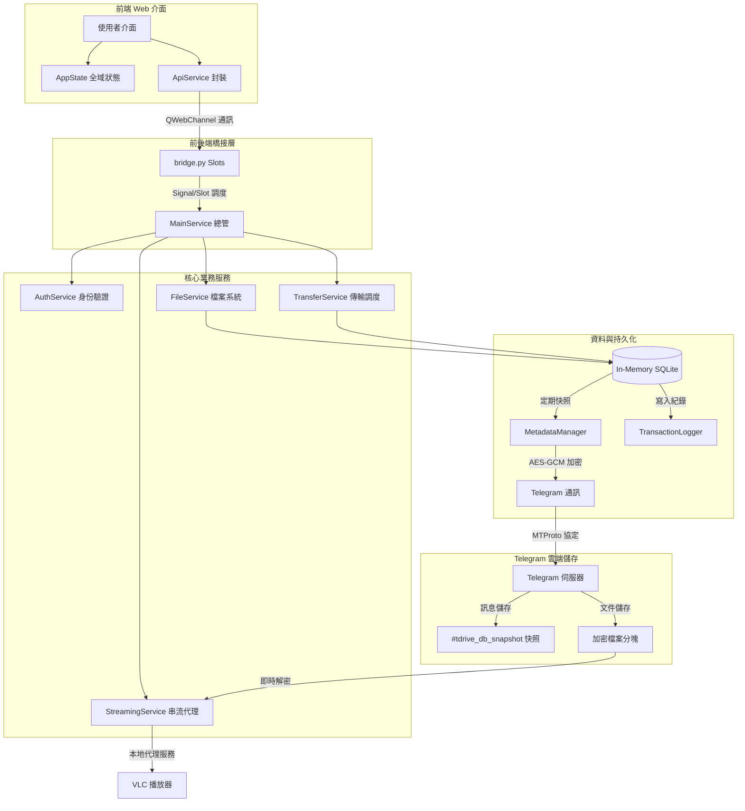

# 🚀 TDrive: 基於 Telegram 的無限雲端儲存

[**English**](../README.md) | [**開發者技術文件 (Developer Documentation)**](./DEVELOPER.md)

**TDrive** 是一款創新的桌面雲端硬碟客戶端，它巧妙地利用 Telegram 的無限制訊息儲存能力，為您提供一個**理論上容量無限、完全加密且永久免費**的個人私有雲空間。

---

## ✨ 核心特色

### 📂 無限空間與智慧儲存
*   **無限容量**: 基於 Telegram MTProto 協定，利用 Telegram 訊息通道儲存檔案，無容量上限限制。
*   **智慧分塊 (Chunking)**: 自動將大型檔案切割並分塊加密上傳，輕鬆突破 Telegram 單一文件大小限制。
*   **秒傳機制 (Deduplication)**: 透過檔案 Hash 識別，已存在於雲端的檔案可實現瞬間轉存，無需重複上傳。

### 🔐 銀行級安全性
*   **端到端加密 (E2EE)**: 所有檔案在離開您的裝置前都會使用 AES-256 加密。金鑰僅存在於本地，連 Telegram 官方伺服器也無法讀取您的檔案內容。
*   **硬體綁定金鑰**: Session 與敏感憑證透過您的硬體 ID 進行加密鎖定，防止資料被惡意竊取至其他裝置。

### 📺 卓越的多媒體體驗
*   **即時串流播放**: 內建本地串流代理伺服器，無需等待完整下載，即可直接使用 VLC 等播放器即時播放雲端影片。
*   **全記憶體縮圖**: 自動為圖片生成縮圖並同步至雲端，提供極速且流暢的圖庫瀏覽體驗。

---

## 🚀 快速開始

TDrive 以獨立執行檔形式發佈，使用者無需配置 Python 環境。

### 1. 下載
請至 [Releases](https://github.com/yourusername/TDrive/releases) 頁面下載最新版本的 `TDrive.exe`。

### 2. 取得 Telegram API 金鑰 (必要步驟)
要使用 TDrive，您必須申請自己的 Telegram API 憑證：
1.  登入 Telegram 官方網站：[**my.telegram.org**](https://my.telegram.org)。
2.  點擊 **"API development tools"**。
3.  填寫表格以建立新應用程式 (標題與簡稱可隨意填寫，例如 "MyTDrive")。
4.  您將獲得 **`App api_id`** 與 **`App api_hash`**。
5.  啟動 `TDrive.exe` 並在提示時輸入這些憑證。

---

## 🏗️ 核心技術架構

TDrive 採用了極具創意的「無狀態轉有狀態」架構，將即時通訊平台轉化為強健的檔案系統。

### 「雲端化資料庫」模式 (Cloud-as-Database)
1.  **記憶體資料庫**: 所有資料夾結構與檔案元數據 (Metadata) 均在極速的記憶體 SQLite 中運作。
2.  **雲端快照同步**: 系統會定期將資料庫狀態打包、壓縮、加密，並以「快照」形式傳送到 Telegram 的私人群組。
3.  **自動還原**: 當您在任何電腦登入時，TDrive 會自動抓取最新快照，瞬間還原您的整個雲端目錄。

### 系統流程圖

---

## 🛡️ 隱私聲明

您的資料隱私是我們的首要任務：
*   TDrive **不會**收集任何使用者資訊或將檔案存儲在任何自有伺服器。
*   所有的數據傳輸均直接在您的裝置與 Telegram 官方伺服器之間進行。
*   加密金鑰在本地生成，絕不會上傳給任何第三方。

---

## 📄 授權協議

本專案採用 MIT 授權協議。詳見 [LICENSE](LICENSE) 檔案。

---
*如果您是開發者，想深入了解內部實作細節，請參閱 [DEVELOPER.md](./DEVELOPER.md)*
